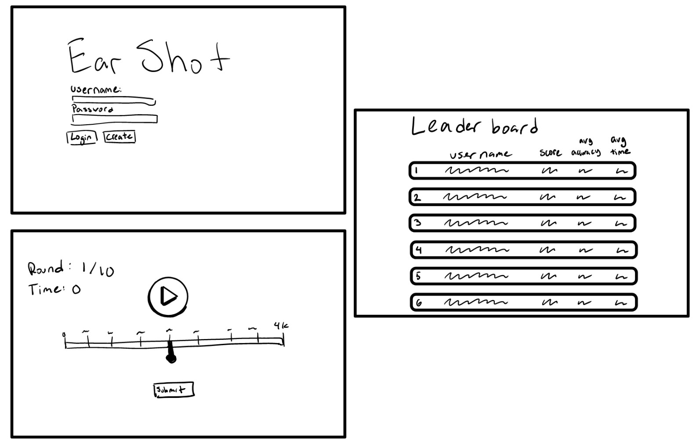
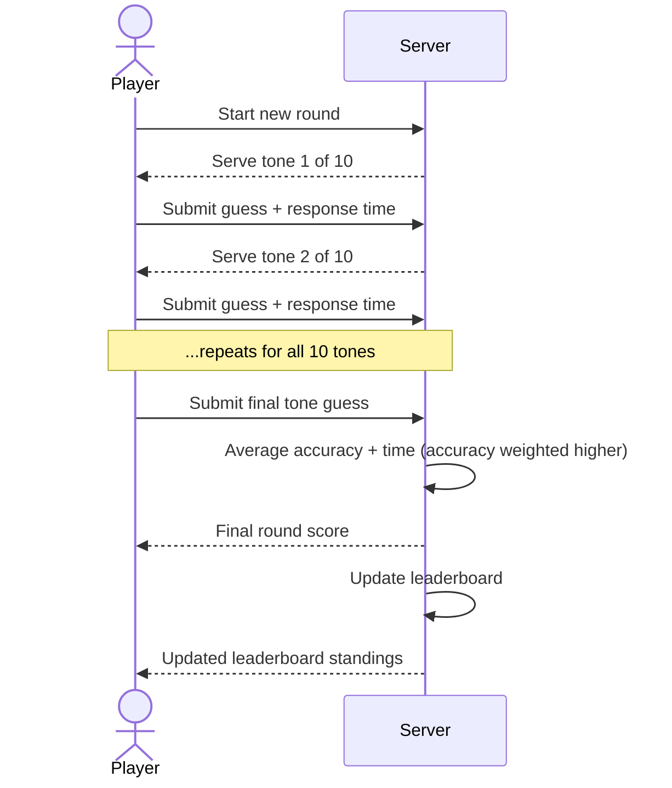

# EarShot

[My Notes](notes.md) | [My website](https://startup.earshot.click) | [My Simon](https://simon.earshot.click)

I want to make a webapp for ear training. I want to make a practice section, where you can train on recognizing tones, and a game section, where you can compete with others on the app. I want the game section to be graded on accuracy and time, and to have authentication of people using their own accounts. I want there to be a global leaderboard. I'm coming at this from an angle of live sound mixing, so I want the game to be focused on quickly and accurately identifying frequencies on their own as well as mixed with other noise (like in ringing out spaces when setting up a live sound system).

> [!NOTE]
> This is a template for your startup application. You must modify this `README.md` file for each phase of your development. You only need to fill in the section for each deliverable when that deliverable is submitted in Canvas. Without completing the section for a deliverable, the TA will not know what to look for when grading your submission. Feel free to add additional information to each deliverable description, but make sure you at least have the list of rubric items and a description of what you did for each item.

> [!NOTE]
> If you are not familiar with Markdown then you should review the [documentation](https://docs.github.com/en/get-started/writing-on-github/getting-started-with-writing-and-formatting-on-github/basic-writing-and-formatting-syntax) before continuing.

### Elevator pitch

Every live sound engineer knows the moment: you're ringing out a room before doors open, and a frequency is feeding back somewhere in the mix, but which one is it? EarShot trains your ear to answer that question instantly. Each round serves up a string of tones, isolated or buried in noise just like a real room, and challenges you to identify them as quickly and accurately as you can. Your round is scored right when you finish, with accuracy weighted above speed, and posted straight to the global leaderboard where you can see how your ears stack up against everyone else who's played.

### Design

```mermaid
sequenceDiagram
    actor Player
    Player->>Server: Start new round
    Server-->>Player: Serve tone 1 of 10
    Player->>Server: Submit guess + response time
    Server-->>Player: Serve tone 2 of 10
    Player->>Server: Submit guess + response time
    Note over Player,Server: ...repeats for all 10 tones
    Player->>Server: Submit final tone guess
    Server->>Server: Average accuracy + time (accuracy weighted higher)
    Server-->>Player: Final round score
    Server->>Server: Update leaderboard
    Server-->>Player: Updated leaderboard standings
```

### Key features

- Secure login over HTTPS with persistent user accounts
- Competitive game mode: each round serves 10 tones, isolated or mixed with noise
- Scoring per round averages accuracy and response time across all 10 tones, with accuracy weighted more heavily
- Global leaderboard ranking each players highscores, updated as soon as a player finishes
- Per-user history to track scores and improvement across past rounds
- *(Stretch goal, time permitting)* Practice mode for untimed, ungraded tone recognition

### Technologies

I am going to use the required technologies in the following ways.

- **HTML** - Three pages: login page, game round page, and the leaderboard page
- **CSS** - Clean, focused layout that keeps attention on the audio controls and round progress, responsive across desktop and mobile
- **React** - Components for tone playback, guess submission, round progress, round results, and the leaderboard; routing between the game and leaderboard views; hooks to manage round state, current tone index, and timing per guess.
- **Service** - Backend endpoints for starting a round, serving each of the 10 tones, submitting guesses, computing the weighted accuracy/time score, and retrieving leaderboard standings. Tone/noise generation handled server-side or via a Web Audio API layer.
- **DB/Login** - User accounts and credentials stored securely, store round scores and per-tone results, so leaderboard standings and personal history persist across sessions.
- **WebSocket** - Realtime broadcast of leaderboard updates as players finish rounds, so standings refresh live for anyone viewing the leaderboard.

## 🚀 Specification Deliverable

> [!NOTE]
> Fill in this sections as the submission artifact for this deliverable. You can refer to this [example](https://github.com/webprogramming260/startup-example/blob/main/README.md) for inspiration.

For this deliverable I did the following. I checked the box `[x]` and added a description for things I completed.

- [x] I completed the prerequisites for this deliverable (Git commit requirement)
- [x] Proper use of Markdown
- [x] A concise and compelling elevator pitch
- [x] Description of key features
- [x] Description of how you will use each technology including your 3rd party API and use of WebSocket
- [x] One or more rough sketches of your application. Images must be embedded in this file using Markdown image references.

## 🚀 AWS deliverable

For this deliverable I did the following. I checked the box `[x]` and added a description for things I completed.

- [x] **Rented EC2 server** - I rented an AWS EC2 instance using t3.nano to host my application server.
- [x] **Leased domain name** - I leased the domain `earshot.click` and pointed its DNS to my EC2 instance.
- [x] **Server accessible** from my domain: [https://earshot.click](https://earshot.click) - My placeholder web application is deployed and accessible over HTTPS, using Caddy as a reverse proxy to automatically provision and manage the TLS certificate.
- **Note:** My startup and Simon are hosted on separate subdomains of the same EC2 instance: the startup app lives at [startup.earshot.click](https://startup.earshot.click) and Simon lives at [simon.earshot.click](https://simon.earshot.click).

## 🚀 HTML deliverable

For this deliverable I did the following. I checked the box `[x]` and added a description for things I completed.

- [x] I completed the prerequisites for this deliverable (Simon deployed, GitHub link, Git commits)
- [x] **HTML pages** - Built six pages: `index.html` (home, with a welcome blurb, "How to Play" steps, and Login/Create Account buttons), `login.html`, `create-account.html`, `game.html` (the round page), `leaderboard.html`, and `profile.html` (personal round history).
- [x] **Proper HTML element usage** - Used semantic elements throughout: `header`, `nav`, `main`, `section`, `footer`, `form`, `table`, `progress`, and `svg` for the tone visualizer.
- [x] **Links** - Every page shares a nav linking Home/Play/Leaderboard/Profile; the login and create-account pages cross-link to each other; the home page links out to the GitHub repo and to MDN's Web Audio API docs.
- [x] **Text** - Headings and paragraphs describe the elevator pitch, how to play steps, security notes, and placeholder explanations on each page.
- [x] **3rd party API placeholder** - The "Frequency Reference" section on the home page marks where a note/frequency lookup API will be integrated later.
- [x] **Images** - `placeholder.png` is used as the site logo in the header on every page.
- [x] **Login placeholder** - `login.html` has a login form, and `create-account.html` has a matching signup form.
- [x] **DB data placeholder** - The leaderboard table on `leaderboard.html` and the round history table on `profile.html` both stand in for data that will be read from the database.
- [x] **WebSocket placeholder** - The "Live Standings" feed on `leaderboard.html` is a placeholder for the real-time score updates that will be pushed to players over a WebSocket connection once the backend is built.

## 🚀 CSS deliverable

For this deliverable I did the following. I checked the box `[x]` and added a description for things I completed.

- [x] I completed the prerequisites for this deliverable (Simon deployed, GitHub link, Git commits)
- [x] **Visually appealing colors and layout. No overflowing elements.** - Built a shared `styles.css` applied across all six pages, using a consistent pink/black brand palette (`#f7446a`) and the Quicksand font. Closed off overflow risks with a `clamp()`-based hero title, `max-width` rules on images/SVGs, Bootstrap `table-responsive` wrappers on the leaderboard and profile tables, and a media query that thins out the frequency slider's tick labels on narrow screens.
- [x] **Use of a CSS framework** - Integrated Bootstrap 5.3.3 via CDN on every page: a responsive navbar component that collapses into a hamburger menu on small screens, Bootstrap buttons, striped/hover tables, a styled progress bar, and `form-control`/`form-label` classes on all inputs.
- [x] **All visual elements styled using CSS** - Every element is styled, layering custom CSS on top of Bootstrap defaults: the navbar, buttons, forms, tables, the round progress bar, and a custom logarithmic-scale frequency slider (styled as a mixer-board fader with tick marks and labels) on the gameplay page.
- [x] **Responsive to window resizing using flexbox and/or grid display** - Used flexbox for the responsive navbar (collapses below 768px), the login/create-account forms, the live-standings list, and the frequency slider's tick labels, with a media query to adjust tick label sizing on small screens.
- [x] **Use of a imported font** - Imported Quicksand from Google Fonts and set it as the site-wide `font-family`.
- [x] **Use of different types of selectors including element, class, ID, and pseudo selectors** - `styles.css` uses element selectors (`body`, `table`, `h2`), class selectors (`.btn-brand`, `.tick`, `.table-card`), ID selectors (`#login`, `#leaderboard`, `#frequency-guess`), and pseudo-selectors (`:hover`, `:focus`, `:first-child`, `:last-child`, plus vendor pseudo-elements for the range slider's thumb).

## 🚀 React part 1: Routing deliverable

For this deliverable I did the following. I checked the box `[x]` and added a description for things I completed.

- [ ] I completed the prerequisites for this deliverable (Simon deployed, GitHub link, Git commits)
- [ ] **Bundled using Vite** - I did not complete this part of the deliverable.
- [ ] **Components** - I did not complete this part of the deliverable.
- [ ] **Router** - I did not complete this part of the deliverable.

## 🚀 React part 2: Reactivity deliverable

For this deliverable I did the following. I checked the box `[x]` and added a description for things I completed.

- [ ] I completed the prerequisites for this deliverable (Simon deployed, GitHub link, Git commits)
- [ ] **All functionality implemented or mocked out** - I did not complete this part of the deliverable.
- [ ] **Hooks** - I did not complete this part of the deliverable.

## 🚀 Service deliverable

For this deliverable I did the following. I checked the box `[x]` and added a description for things I completed.

- [ ] I completed the prerequisites for this deliverable (Simon deployed, GitHub link, Git commits)
- [ ] **Node.js/Express HTTP service** - I did not complete this part of the deliverable.
- [ ] **Static middleware for frontend** - I did not complete this part of the deliverable.
- [ ] **Calls to third party endpoints** - I did not complete this part of the deliverable.
- [ ] **Backend service endpoints** - I did not complete this part of the deliverable.
- [ ] **Frontend calls service endpoints** - I did not complete this part of the deliverable.
- [ ] **Supports registration, login, logout, and restricted endpoint** - I did not complete this part of the deliverable.
- [ ] **Uses BCrypt to hash passwords** - I did not complete this part of the deliverable.

## 🚀 DB deliverable

For this deliverable I did the following. I checked the box `[x]` and added a description for things I completed.

- [ ] I completed the prerequisites for this deliverable (Simon deployed, GitHub link, Git commits)
- [ ] **Stores data in MongoDB** - I did not complete this part of the deliverable.
- [ ] **Stores credentials in MongoDB** - I did not complete this part of the deliverable.

## 🚀 WebSocket deliverable

For this deliverable I did the following. I checked the box `[x]` and added a description for things I completed.

- [ ] I completed the prerequisites for this deliverable (Simon deployed, GitHub link, Git commits)
- [ ] **Backend listens for WebSocket connection** - I did not complete this part of the deliverable.
- [ ] **Frontend makes WebSocket connection** - I did not complete this part of the deliverable.
- [ ] **Data sent over WebSocket connection** - I did not complete this part of the deliverable.
- [ ] **WebSocket data displayed** - I did not complete this part of the deliverable.
- [ ] **Application is fully functional** - I did not complete this part of the deliverable.
